We analyzed more than 5,000,000,000 rows of GitHub event data and got the results here. In this report, you'll get interesting findings about open source software on GitHub in 2022, including:

* Top programming languages
* Geographic distribution
* Contribution time allocation
* Technology trends
* The most popular repositories
* The most active repositories
* Top stargazers
* The most active developers

## Top languages in the open source world over the past four years

This chart ranks programming languages yearly from 2019 to 2022 based on the ratio of new repositories using these languages to all new repositories.

 

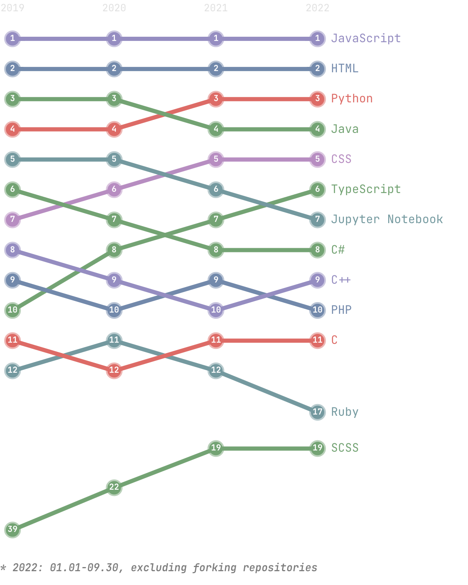

<em>Top programming languages</em>

 

Insights:

* Python surpassed Java and moved to #3 in 2021.
* TypeScript rose from  #10 to #6, and SCSS rose from #39 to #19. The rise of SCSS shows that open source projects that value front-end expressiveness are gradually gaining popularity.
* The two languages Ruby and R dropped a lot in ranking over the years.

### Rankings of back-end programming languages

The programming languages used in a pull request reflect which languages developers used. To find out the most popular back-end programming languages, we queried the distribution of programming languages by new pull requests from 2019 to 2022 and took the top 10 for each year.

 

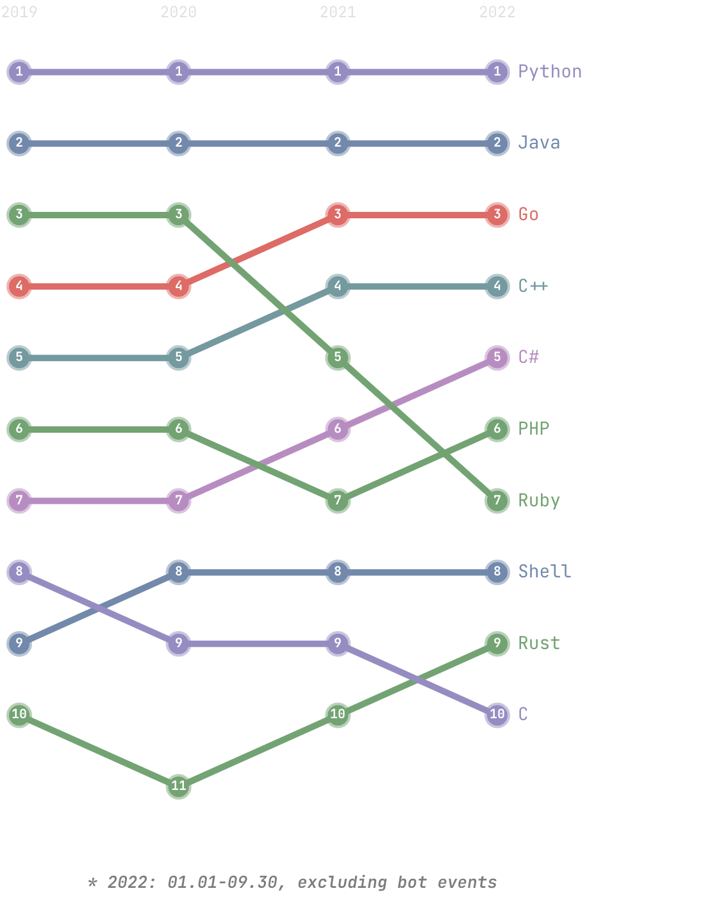

<em>Top back-end programming languages</em>

 

The chart data indicates:

* Python and Java rank #1 and #2 respectively. In 2021, Go overtook Ruby to rank #3 in 2021.
* Rust has been trending upward for several years, ranking #9 in 2022.

## Geographic distribution of developer behavior

We queried the number of various events that occurred throughout the world from January 1 to September 30, 2022 and identified the top 10 countries by the number of events triggered by developers in these countries. The chart displays the proportion of each event type by country or region.

 

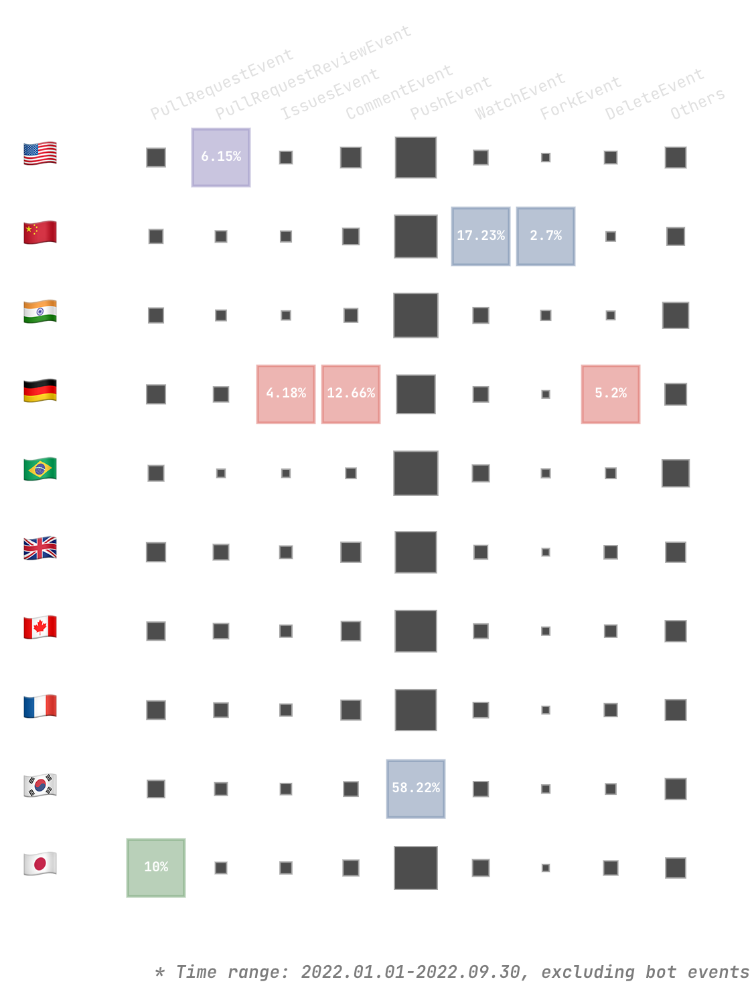

<em>Geographic distribution of developer behavior</em>

 

The chart shows that:

* The events triggered in the top 10 countries account for about 23.27% of all GitHub events. However, the number of developers from these countries is only 10%.
* US developers are most likely to review code, with a PullRequestReviewEvent share of 6.15%.
* Korean developers prefer pushing directly to repositories (PushEvent).
* Japanese developers are most likely to submit code via pull requests, with a PullRequestEvent share of 10%.
* German developers like to open issues and comments, with IssueEvent and CommentEvent accounting for 4.18% and 12.66% respectively.
* Chinese developers like to star repositories, with 17.23% for WatchEvent and 2.7% for ForkEvent.

Notes:

* In 2022, 17,062,081 developers had behavioral events, and 2,923,523 of them have the Location field, so the sampling rate is 17.13%
* GitHub identifies 15 types of events. We only show commonly used types. Comment Event includes CommitCommentEvent, IssueCommentEvent, and PullRequestReviewCommentEvent. Others includes MemberEvent, CreateEvent, ReleaseEvent, GollumEvent, and PublicEvent.

## Developer behavior distribution on weekdays and weekends

We queried the distribution of each event type over the seven days of the week.

 

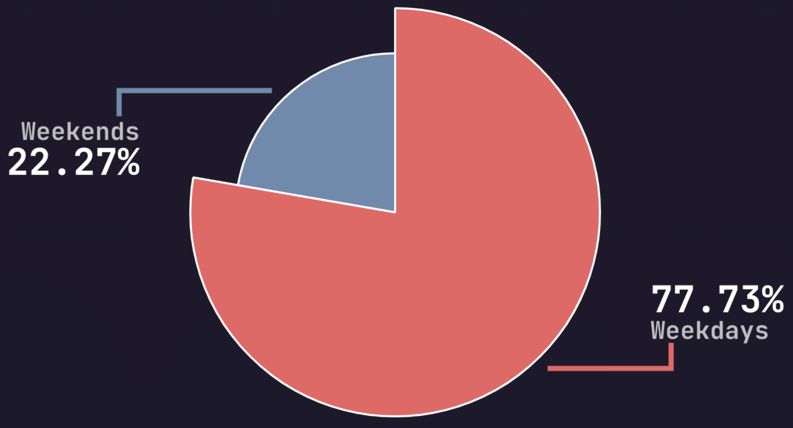

<em>Developer behavior distribution on weekdays and weekends</em>

 

<em>Developer behavior distribution from Monday to Sunday</em>

 

Insights:

* Developers are most active on weekdays, with 77.73% of events occurring on weekdays.
* Pull Request Event, Pull Request Review Event, and Issues Event all have the highest percentage on Tuesdays, while the lowest percentage is on the weekends.
* The amount of Push Event, Watch Event, and Fork Event activities are similar on weekdays and weekends, while the Pull Request Review Event is the most different. Watch Event and Fork Event are more personal behaviors, Pull Request Review Events are more work behaviors, and Push Events are used more in personal projects.

## Popular open source topics

Each year, technology introduces new buzz words. Can we gain insight into technical trends through the open source repositories behind the hot words? We investigated five technical areas: Low Code, Web3, GitHub Actions, Database, and AI.

### Activity levels of popular topics

We queried the number of open source repositories associated with each technical area, as well as the percentage of active repositories in 2022.

 

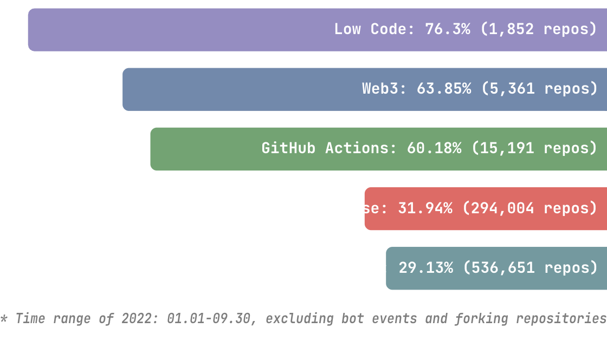

<em>Activity levels of popular topics</em>

 

This figure shows that open source repositories in the Low Code topic are the most active, with 76.3% being active in 2022, followed by Web3 with 63.85%.

### Popular topics over the years

We queried the following items for each technical area from 2015 to 2022:

* The annual increment of repositories
* The annual increment of collaborative events
* The number of developers participating in collaborative events
* The annual increment of stars

Then, we calculated the growth rate for each year which can reflect new entrants, developer engagement in this technical field, and the industry's interest in this area. For 2022, we compare its first nine months with the first nine months of 2021.

 

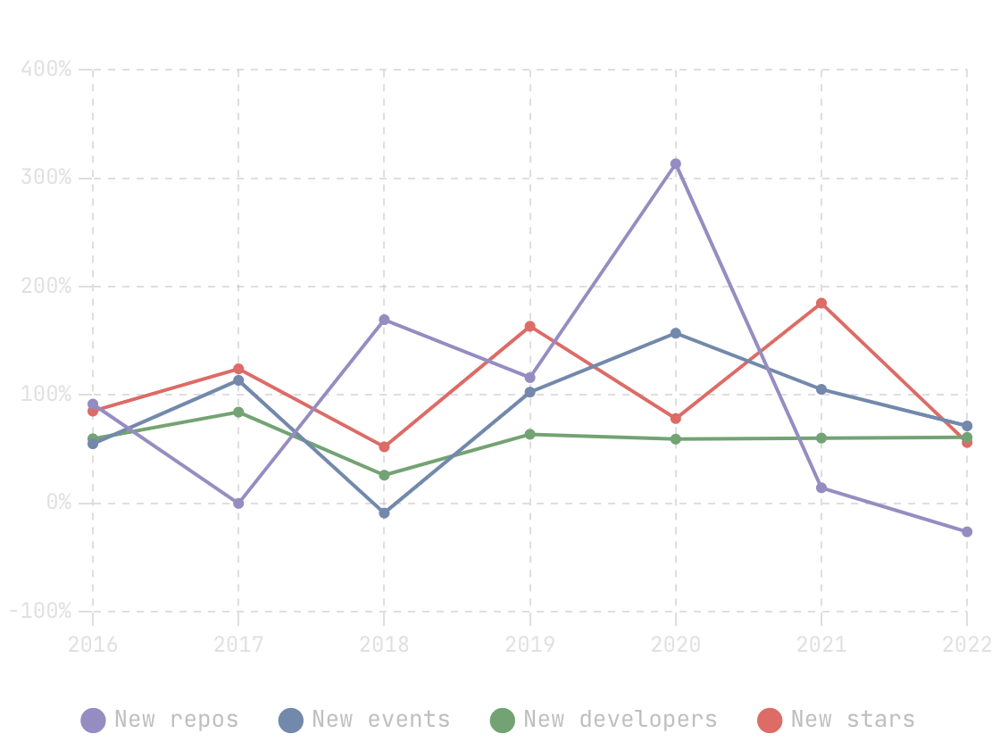

<em>Low code repositories</em>

 

We can see that 2020 is the peak period of project development, with a 313.43% increase in new repositories and a 157.06% increase in developer collaborative events. The industry's interest increased most significantly in 2021, reaching 184.82%. In 2022, the year-on-year growth data shows that the number of new repositories decreased (-26.21%), but developer engagement and industry interest are still rising.

* Time range of 2022: 01.01-09.30, excluding bot events and forking repositories

 

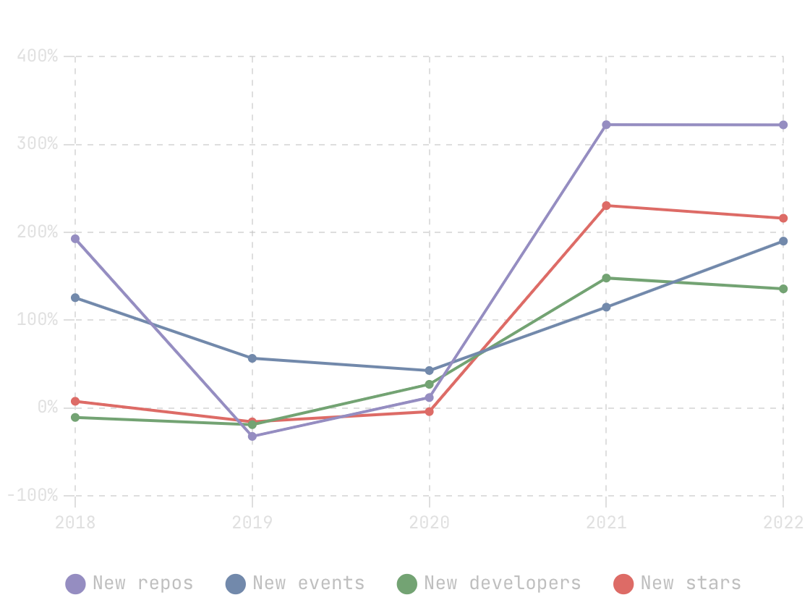

<em>Web3 repositories</em>

 

Whether it is the creation of new repositories, developers, or the interest of the industry, the Web3 ecosystem has grown rapidly in recent years, and the growth rate of new repositories peaked at 322.65% in 2021.

* Time range of 2022: 01.01-09.30, excluding bot events and forking repositories

 

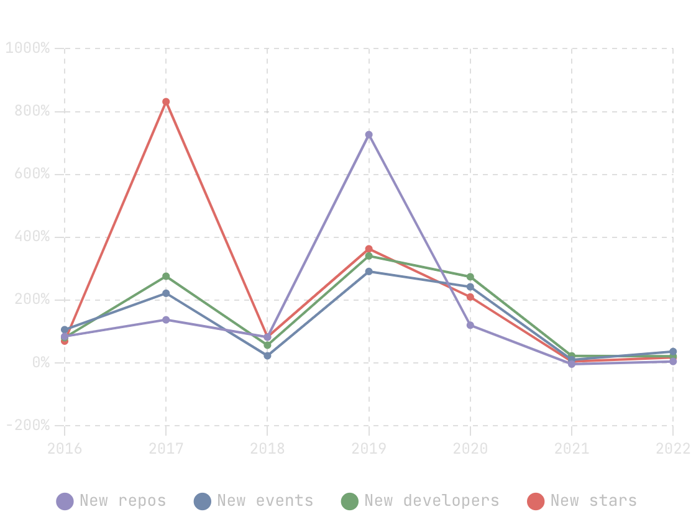

<em>GitHub Actions repositories</em>

 

The annual increase of GitHub Actions repositories has been declining, but developer engagement and the industry's interest are still increasing slightly.

* Time range of 2022: 01.01-09.30, excluding bot events and forking repositories

 

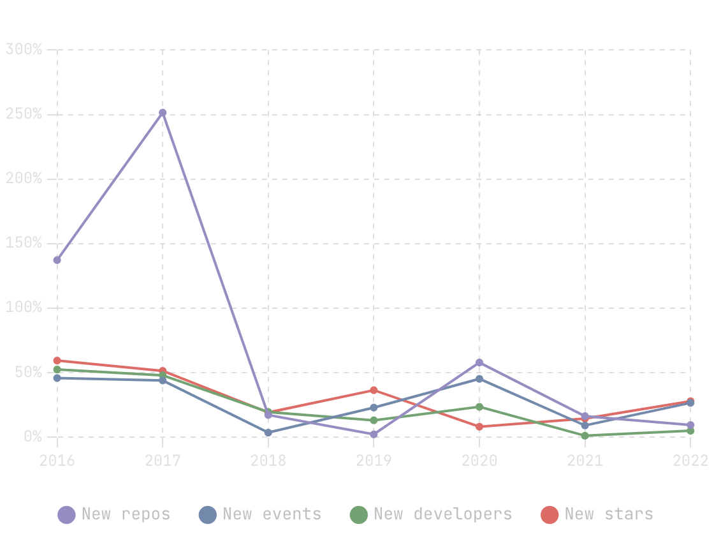

<em>Database repositories</em>

 

As an infrastructure project, the Database project's threshold is high. Compared with projects in other fields, a database project has a stable growth rate.

* Time range of 2022: 01.01-09.30, excluding bot events and forking repositories

 

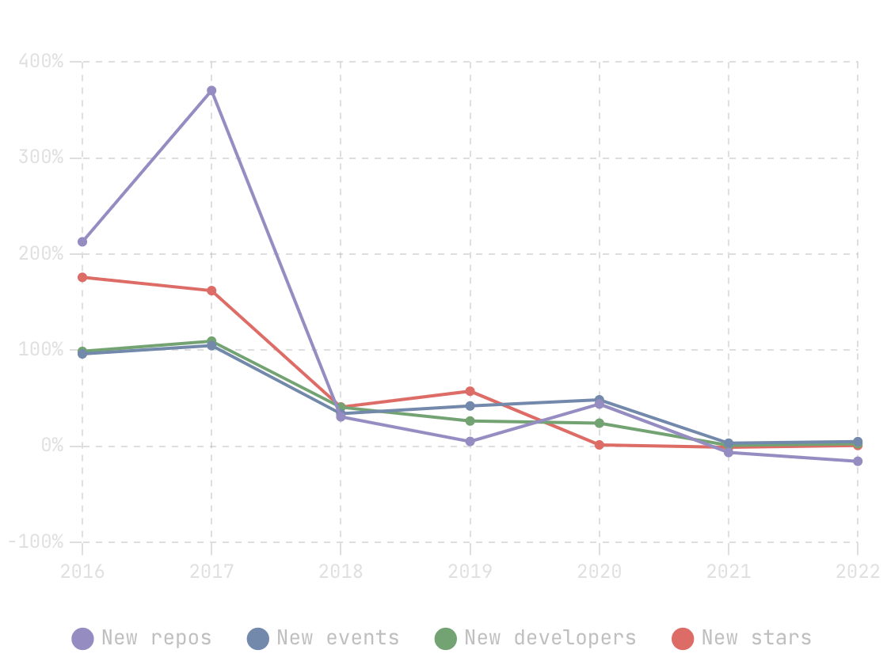

<em>AI repositories</em>

 

After two years of high growth in 2016 and 2017, open source projects in AI have been growing  gradually slowly.

* Time range of 2022: 01.01-09.30, excluding bot events and forking repositories

## The most popular repositories in 2022

The number of stars is the most visible indication of the popularity of open source projects. We looked at the 50 projects that received the most stars from January 1 to September 30, 2022. We found that:

 

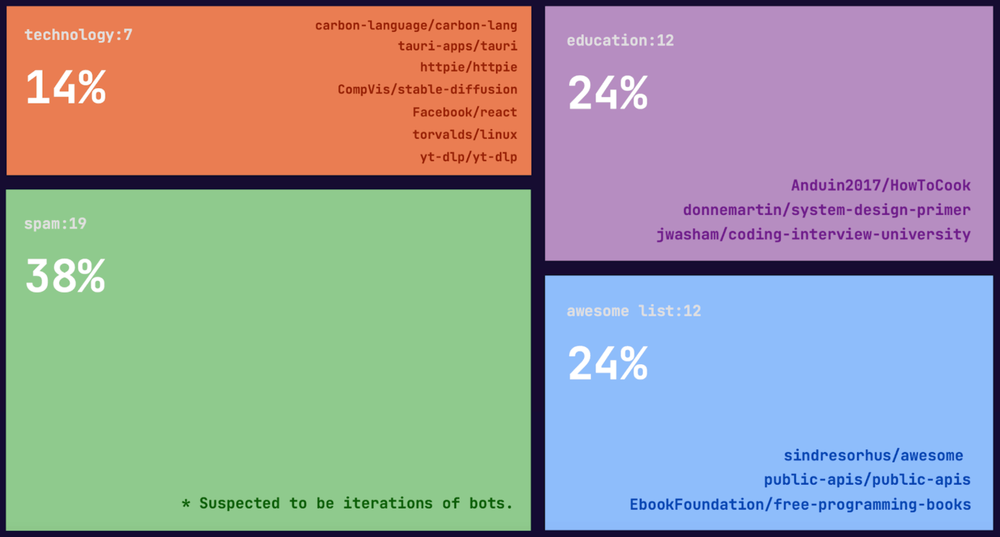

<em>The most popular repositories in 2022</em>

 

* Time range: 2022.01.01-2022.09.30, excluding bot events

## The most active repositories over the past four years

Here we looked up the top 20 active repositories per year from 2019 to 2022 and counted the total number of listings per repository. The activity of the repository is ranked according to the number of developers participating in collaborative events.

<table>
  <tr>
   <td><strong>Repository Name</strong>
   </td>
   <td><strong>Count</strong>
   </td>
  </tr>
  <tr>
   <td><a href="https://ossinsight.io/analyze/microsoft/vscode">microsoft/vscode</a>
   </td>
   <td>4
   </td>
  </tr>
  <tr>
   <td><a href="https://ossinsight.io/analyze/flutter/flutter">flutter/flutter</a>
   </td>
   <td>4
   </td>
  </tr>
  <tr>
   <td><a href="https://ossinsight.io/analyze/MicrosoftDocs/azure-docs">MicrosoftDocs/azure-docs</a>
   </td>
   <td>4
   </td>
  </tr>
  <tr>
   <td><a href="https://ossinsight.io/analyze/firstcontributions/first-contributions">firstcontributions/first-contributions</a>
   </td>
   <td>4
   </td>
  </tr>
  <tr>
   <td><a href="https://ossinsight.io/analyze/Facebook/react-native">Facebook/react-native</a>
   </td>
   <td>4
   </td>
  </tr>
  <tr>
   <td><a href="https://ossinsight.io/analyze/pytorch/pytorch">pytorch/pytorch</a>
   </td>
   <td>4
   </td>
  </tr>
  <tr>
   <td><a href="https://ossinsight.io/analyze/microsoft/TypeScript">microsoft/TypeScript</a>
   </td>
   <td>4
   </td>
  </tr>
  <tr>
   <td><a href="https://ossinsight.io/analyze/tensorflow/tensorflow">tensorflow/tensorflow</a>
   </td>
   <td>3
   </td>
  </tr>
  <tr>
   <td><a href="https://ossinsight.io/analyze/kubernetes/kubernetes">kubernetes/kubernetes</a>
   </td>
   <td>3
   </td>
  </tr>
  <tr>
   <td><a href="https://ossinsight.io/analyze/DefinitelyTyped/DefinitelyTyped">DefinitelyTyped/DefinitelyTyped</a>
   </td>
   <td>3
   </td>
  </tr>
  <tr>
   <td><a href="https://ossinsight.io/analyze/golang/go">golang/go</a>
   </td>
   <td>3
   </td>
  </tr>
  <tr>
   <td><a href="https://ossinsight.io/analyze/google/it-cert-automation-practice">google/it-cert-automation-practice</a>
   </td>
   <td>3
   </td>
  </tr>
  <tr>
   <td><a href="https://ossinsight.io/analyze/home-assistant/core">home-assistant/core</a>
   </td>
   <td>3
   </td>
  </tr>
  <tr>
   <td><a href="https://ossinsight.io/analyze/microsoft/PowerToys">microsoft/PowerToys</a>
   </td>
   <td>3
   </td>
  </tr>
  <tr>
   <td><a href="https://ossinsight.io/analyze/microsoft/WSL">microsoft/WSL</a>
   </td>
   <td>3
   </td>
  </tr>
</table>

Insights:

* Microsoft has the most repositories on the list, with five.
* tensorflow/tensorflow and kubernetes/kubernetes both dropped out of the top 20 after three consecutive years on the list (2019 to 2021).
* New to the 2022 list are archway-network/testnets, element-fi/elf-council-frontend, solana-labs/token-list, education/GitHubGraduation-2022, taozhiyu/TyProAction, NixOS/nixpkgs, rust-lang/rust.

* Time range: 2022.01.01-2022.09.30, excluding bot events

## Who gave the most stars in 2022

We queried the developers who gave the most stars in 2022, took the top 20, and filtered out accounts of suspected bots. If a developer's number of star events divided by the number of starred repositories is equal to or greater than 2, we suspect this user to be a bot.

 

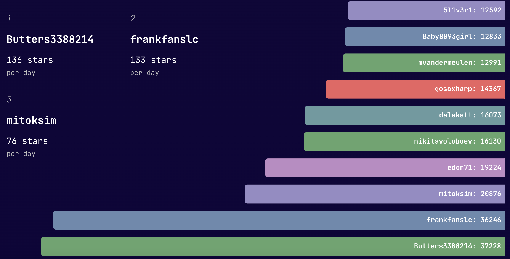

<em>Developers who gave the most stars</em>

 

We found that until September 30, 2022, the developer who starred the most repositories had starred a total of 37,228 repositories, an average of 136 repositories per day.

* Time range: 2022.01.01-2022.09.30, excluding bot events

## The most active developers since 2011

We queried the top 20 most active developers per year since 2011. This time we didn't filter out bot events.

 

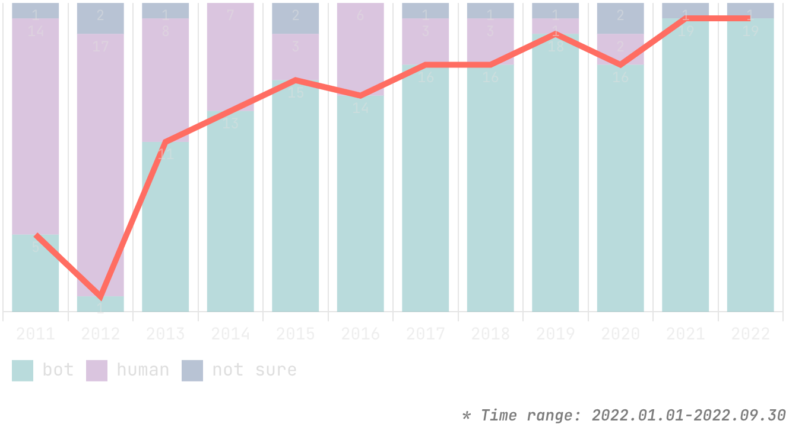

<em>The most active developers</em>

 

We found that the percentage of bots is becoming larger and larger. Bots started to overtake humans in 2013 and have reached over 95% in 2022.

## Appendix

### Term description

* **GitHub events**: GitHub events are triggered by user actions, like starring a repository or pushing code.
* **Time range**: In this report, the data collection range of 2022 is from January 1, 2022 to September 30, 2022. When comparing data of 2022 with another year, we use year-on-year analysis.
* **Bot events**: Bot-triggered events account for a growing percentage of GitHub events. However, these events are not the focus of this report. We filtered out most of the bot-initiated events by matching regular expressions.

### How we classify technical fields by topics

We do exact matching and fuzzy matching based on the repository topic. Exact matching means that the repository topics have a topic that exactly matches the word, and fuzzy matching means that the repository topics have a topic that contains the word.

<table>
  <tr>
   <td><strong>Topic</strong>
   </td>
   <td><strong>Exact matching</strong>
   </td>
   <td><strong>Fuzzy matching</strong>
   </td>
  </tr>
  <tr>
   <td><strong>GitHub Actions</strong>
   </td>
   <td>actions
   </td>
   <td>github-action, gh-action
   </td>
  </tr>
  <tr>
   <td><strong>Low Code</strong>
   </td>
   <td>
   </td>
   <td>low-code, lowcode, nocode, no-code
   </td>
  </tr>
  <tr>
   <td><strong>Web3</strong>
   </td>
   <td>
   </td>
   <td>web3
   </td>
  </tr>
  <tr>
   <td><strong>Database</strong>
   </td>
   <td>db
   </td>
   <td>database, databases

nosql, newsql, sql

mongodb,neo4j
   </td>
  </tr>
  <tr>
   <td><strong>AI</strong>
   </td>
   <td>ai, aiops, aiot
   </td>
   <td>artificial-intelligence, machine-intelligence

computer-vision, image-processing, opencv, computervision, imageprocessing

voice-recognition, speech-recognition, voicerecognition, speechrecognition, speech-processing

machinelearning, machine-learning

deeplearning, deep-learning

transferlearning, transfer-learning

mlops

text-to-speech, tts, speech-synthesis, voice-synthesis

robot, robotics

sentiment-analysis

natural-language-processing, nlp

language-model, text-classification, question-answering, knowledge-graph, knowledge-base

gan, gans, generative-adversarial-network, generative-adversarial-networks

neural-network, neuralnetwork, neuralnetworks, neural-network, dnn

tensorflow

PyTorch

huggingface

transformers

seq2seq, sequence-to-sequence

data-analysis, data-science

object-detection, objectdetection

data-augmentation

classification

action-recognition
   </td>
  </tr>
</table>
